# AI Crew Org Charts

Visual representations of the agent hierarchy and relationships.

---

## Mermaid Diagram: Full Hierarchy

---

## Mermaid Diagram: Reporting Hierarchy Only

---

## Mermaid Diagram: Information Flows

---

## Mermaid Diagram: Domain Clusters

```mermaid
flowchart TB
    subgraph Coordination["🎯 Coordination Layer"]
        direction LR
        Xavier["Xavier<br/>Operations"]
        Aurelius["Aurelius<br/>Accountability"]
        Clare["Clare<br/>Communications"]
    end

    subgraph Personal["👤 Personal Staff"]
        direction TB
        Evelyn["Evelyn - EA"]
        Eleanor["Eleanor - CRM"]
        Warren["Warren - Finance"]
        Hetty["Hetty - Tax"]
        Galen["Galen - Health"]
        Martha["Martha - Home"]
        Marco["Marco - Travel"]
        Seneca["Seneca - Learning"]
        Iris["Iris - Knowledge"]
    end

    subgraph HazeGray["💼 Haze Gray"]
        direction TB
        Helena["Helena - BD"]
        Cicero["Cicero - Pitches"]
        Dale["Dale - Content"]
        Hamilton["Hamilton - Delivery"]
    end

    subgraph Puzzlehouse["🧩 Puzzlehouse"]
        direction TB
        Ada["Ada - Social"]
        Franklin["Franklin - Ops"]
        Clara["Clara - Support"]
    end

    Coordination --> Personal
    Coordination --> HazeGray
    Coordination --> Puzzlehouse
```

---

## Mermaid Diagram: Escalation Paths

---

## How to Use These Diagrams

### In GitHub
GitHub renders Mermaid automatically. Just view this file.

### In Notion
Copy the Mermaid code block and paste into a Notion code block with language set to "mermaid".

### In Obsidian
Mermaid is natively supported. Just paste.

### Export to PNG/SVG
Use the [Mermaid Live Editor](https://mermaid.live):
1. Paste the diagram code
2. Click "Download PNG" or "Download SVG"

### In Presentations
Export as image, or use tools like [Mermaid Chart](https://www.mermaidchart.com/) for interactive versions.

---

## Excalidraw Version

For a more free-form visual, see [ORG_CHART.excalidraw](ORG_CHART.excalidraw).

The Excalidraw file provides:
- Drag-and-drop repositioning
- Hand-drawn aesthetic
- Custom annotations
- Export to PNG, SVG, or embed

---

*Keep these diagrams updated as agents are added or removed.*
